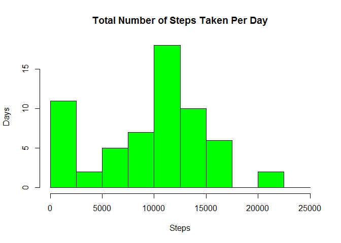
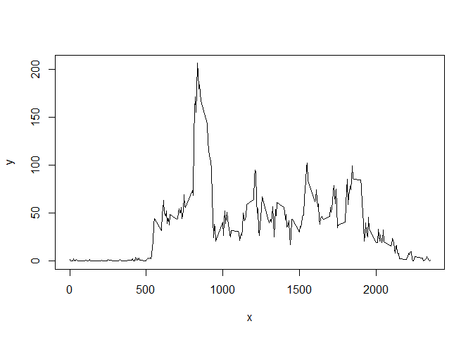
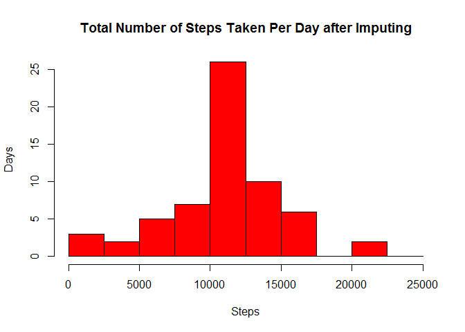
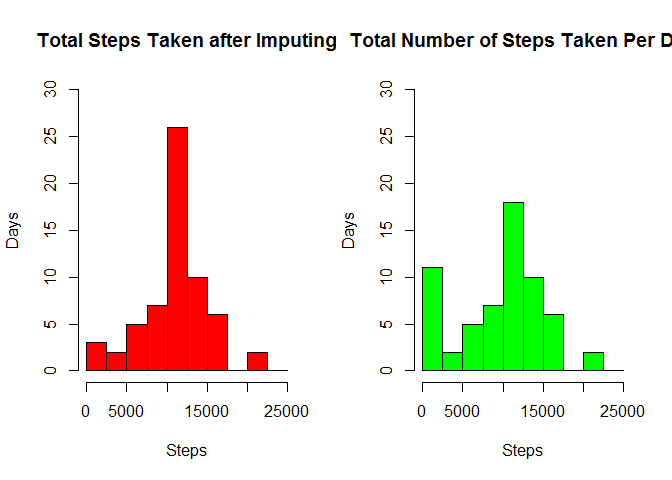
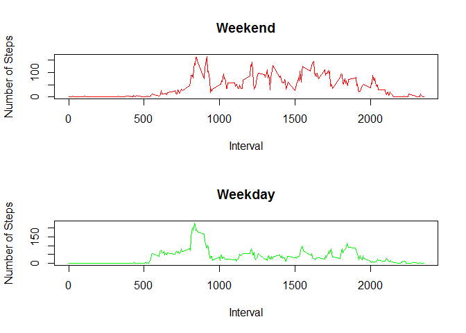

# Project 1 Reproducible Research
Samantha Stabley  
July 28, 2017  


For this assignment I will be looking at data from a personal activity monitoring device. This device collects data at 5 minute intervals through out the day. The data consists of two months of data from an anonymous individual collected during the months of October and November, 2012 and include the number of steps taken in 5 minute intervals each day.

The data for this assignment can be downloaded from the course web site:  

https://d396qusza40orc.cloudfront.net/repdata%2Fdata%2Factivity.zip

The variables included in this dataset are:

- steps: Number of steps taking in a 5-minute interval (missing values are coded as NA)
- date: The date on which the measurement was taken in YYYY-MM-DD format
- interval: Identifier for the 5-minute interval in which measurement was taken

The dataset is stored in a comma-separated-value (CSV) file and there are a total of 17,568 observations in this dataset.


Before we begin manipulating the data we will need to load it:

```r
setwd("C:/Users/Samantha/Desktop/data_science/Reproducible Research/project 1")
activity<-read.csv("activity.csv")
summary(activity)
```

```
##      steps                date          interval     
##  Min.   :  0.00   2012-10-01:  288   Min.   :   0.0  
##  1st Qu.:  0.00   2012-10-02:  288   1st Qu.: 588.8  
##  Median :  0.00   2012-10-03:  288   Median :1177.5  
##  Mean   : 37.38   2012-10-04:  288   Mean   :1177.5  
##  3rd Qu.: 12.00   2012-10-05:  288   3rd Qu.:1766.2  
##  Max.   :806.00   2012-10-06:  288   Max.   :2355.0  
##  NA's   :2304     (Other)   :15840
```
###What is the mean total number of steps taken per day?

To get a general idea of what this data looks like, lets look at the total number of steps our anonymous volunteer took each day. We are going to ignore all missing values for this evaluation.


```r
##I chose to code all missing data equal to 0 so it does not effect the sum
NAs<-activity[,1]
NAs[is.na(NAs)]<-0
activity1<-activity
activity1[,1]<-NAs

activity1$date<- as.Date (activity1$date)
##Use aggregate function to sort data by date
SumByDay<-aggregate(activity1$steps, by=list(activity1$date), FUN=sum)

summary(SumByDay)
```

```
##     Group.1                 x        
##  Min.   :2012-10-01   Min.   :    0  
##  1st Qu.:2012-10-16   1st Qu.: 6778  
##  Median :2012-10-31   Median :10395  
##  Mean   :2012-10-31   Mean   : 9354  
##  3rd Qu.:2012-11-15   3rd Qu.:12811  
##  Max.   :2012-11-30   Max.   :21194
```

To look at the data in a more understandable format, I will use a histogram to plot the total number of steps taken each day.


```r
hist(SumByDay[,2], main="Total Number of Steps Taken Per Day", breaks=seq(from=0,to=25000,by=2500), col="green", xlab="Steps", ylab="Days")
```

<!-- -->
From this histogram it appears that this person usually takes between 10,000-15,000 steps per day.  There is also a peak at the very lower end, but this is probably due the amount of missing data we have in this data set.  We will attempt to fix this later.  In order to get a more precise estimate on the average steps per day for this individual, lets look at the mean and median of the total number of steps per day.

```r
mean(SumByDay[,2])
```

```
## [1] 9354.23
```

```r
median(SumByDay[,2])
```

```
## [1] 10395
```
So 9,354.23 and 10,395, both very close to our expected data range (10,000-15,000) but a little lower then the graph suggests at first glance.  Again, probably due to peak where we have missing data.

###What is the average daily activity pattern?
Another interesting thing about this data is we can use the interval breakup to see when this individual is most active.  Using a time series plot we can look at the average of steps taken at each time of day across all days.


```r
activity2<-activity[,-2]
##Using aggregate again to sort data, this time sorting by time interval
interval<-aggregate(.~interval, data=activity2, mean, na.rm=TRUE)
x<-interval[,1]
y<-interval[,2]
plot(x,y, type="l")
```

<!-- -->

From this plot we can guess that this person wakes at around 500 mark, and has a large peak not too long after, maybe the 800-900 mark.  Might be interesting to look at which interval on average actually has the maximum number of steps.

```r
interval[(which.max(interval$steps)),]
```

```
##     interval    steps
## 104      835 206.1698
```

###Imputing missing values
The missing values in this data may be causing some skewing of our calculations. We can look at the summary of the data to find how much of the data is missing?


```r
summary(activity)
```

```
##      steps                date          interval     
##  Min.   :  0.00   2012-10-01:  288   Min.   :   0.0  
##  1st Qu.:  0.00   2012-10-02:  288   1st Qu.: 588.8  
##  Median :  0.00   2012-10-03:  288   Median :1177.5  
##  Mean   : 37.38   2012-10-04:  288   Mean   :1177.5  
##  3rd Qu.: 12.00   2012-10-05:  288   3rd Qu.:1766.2  
##  Max.   :806.00   2012-10-06:  288   Max.   :2355.0  
##  NA's   :2304     (Other)   :15840
```
So 2304 of the 17568 values, or about 13%.  Thats enough that we may want to try and replace these values to get a more substancial view of this data, without the skewing the missing data is causing.

Imputing these missing values can be a tricky move since there is no way to know what the subject was actually doing during these times.  I chose to impute the missing values with the average steps of the same time interval, hoping that the intervals patterns would suffice in keeping the integrity of the data.


```r
activity3<-activity
##Creating for loop to apply averages to NA's only
for(i in 1:17568){
	if (is.na(activity[i,1])) {
		r<-activity[i,3]
#Taking rounded mean of the same time interval		
		s<-round(mean(activity$steps[activity$interval==r],na.rm=TRUE))
 		activity3[i,1]<-s
	}
}

summary(activity3)
```

```
##      steps                date          interval     
##  Min.   :  0.00   2012-10-01:  288   Min.   :   0.0  
##  1st Qu.:  0.00   2012-10-02:  288   1st Qu.: 588.8  
##  Median :  0.00   2012-10-03:  288   Median :1177.5  
##  Mean   : 37.38   2012-10-04:  288   Mean   :1177.5  
##  3rd Qu.: 27.00   2012-10-05:  288   3rd Qu.:1766.2  
##  Max.   :806.00   2012-10-06:  288   Max.   :2355.0  
##                   (Other)   :15840
```
Now that we have adjusted our data, lets take a look at the new and improved data set.


```r
activity3$date<- as.Date (activity3$date)
SumByDay3<-aggregate(activity3$steps, by=list(activity3$date), FUN=sum)

hist(SumByDay3[,2], main="Total Number of Steps Taken Per Day after Imputing", breaks=seq(from=0,to=25000,by=2500), col="red", xlab="Steps", ylab="Days")
```

<!-- -->
Our first mean and median were 9,354.23 and 10,395.  Lets re-compute these with our imputed data.


```r
mean(SumByDay3[,2])
```

```
## [1] 10765.64
```

```r
median(SumByDay3[,2])
```

```
## [1] 10762
```
So our mean went from 9,354.23 to 10765.64
and median from 10,395 to 10762.  
Not as big of a difference as expected.

So how exactly has our data layout changed?  Looking at the plots side by side may help show any obvious changes in distribution.


```r
par(mfrow=c(1,2))

hist(SumByDay3[,2], main="Total Steps Taken after Imputing", breaks=seq(from=0,to=25000,by=2500), col="red", xlab="Steps", ylab="Days",  ylim=c(0,30))

hist(SumByDay[,2], main="Total Number of Steps Taken Per Day", breaks=seq(from=0,to=25000,by=2500), col="green", xlab="Steps", ylab="Days", ylim=c(0,30))
```

<!-- -->
We see the peak in the very beginning has lowered significantly, and the middle peak has greatly increased.  This new shape more closely resembles a bell curve.


###Are there differences in activity patterns between weekdays and weekends?

It may be interesting to note if steps patterns change for weekends considering most people's schedules change during that time.  To look at this we must create new factor for the data set.

```r
activity4<-activity3
d<-activity4$date
#Adding vector that will decode the date into a day of the week
Day<-weekdays(d)
activity4<-cbind(activity3,Day)
#Using a for loop to classify each day as either a "weekday" or "weekend"
Day_of_Week<-vector()
for (i in 1:17568){
	if (activity4[i,4] %in% c("Monday","Tuesday","Wednesday","Thursday","Friday")){
		Day_of_Week[i]<-"Weekday"
	}
	else {Day_of_Week[i]<-"Weekend"}}
activity5<-cbind(activity4,Day_of_Week)
head(activity5)
```

```
##   steps       date interval    Day Day_of_Week
## 1     2 2012-10-01        0 Monday     Weekday
## 2     0 2012-10-01        5 Monday     Weekday
## 3     0 2012-10-01       10 Monday     Weekday
## 4     0 2012-10-01       15 Monday     Weekday
## 5     0 2012-10-01       20 Monday     Weekday
## 6     2 2012-10-01       25 Monday     Weekday
```
We can see from these first rows of the data set that day of the week has been added and whether that day is considered a weekend or weekday.

A panel plot can help us look at both weekday and weekend step averages side by side.

```r
Weekday<-data.frame()
Weekend<-data.frame()
#Use a for loop to separate weekday data from weekend data
for (i in 1:17568){
	if (activity5[i,5]=="Weekday"){
		Weekday<-rbind(activity5[i,],Weekday)
	}
	else {Weekend<-rbind(activity5[i,],Weekend)}}
int_weekday<-aggregate(.~interval, data=Weekday, mean, na.rm=TRUE)
int_weekend<-aggregate(.~interval, data=Weekend, mean, na.rm=TRUE)

#Show graphs side by side
par(mfrow=c(2,1))
plot(int_weekend[,1],int_weekend[,2], main="Weekend", type="l",col="red", xlab="Interval", ylab="Number of Steps")
plot(int_weekday[,1],int_weekday[,2], main="Weekday", type="l",col="green", xlab="Interval", ylab="Number of Steps")
```

<!-- -->
We notice Weekdays have a huge spike right around that 800-900 time interval which is higher than the weekend spike, but less variability after that.  Weekends have several spikes and in general seem to have a greater number of steps overall.
